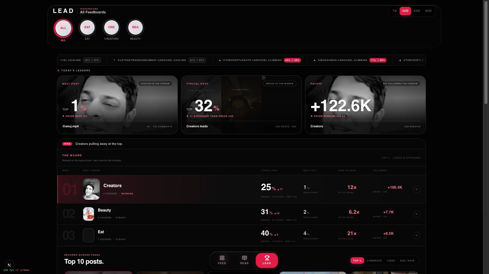
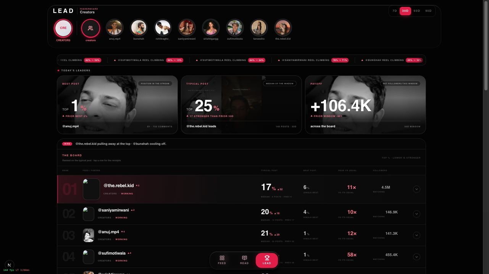
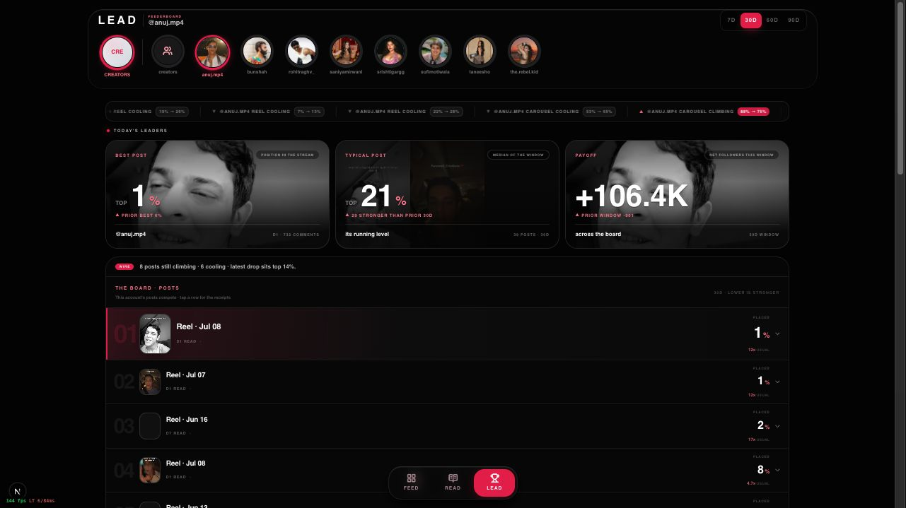
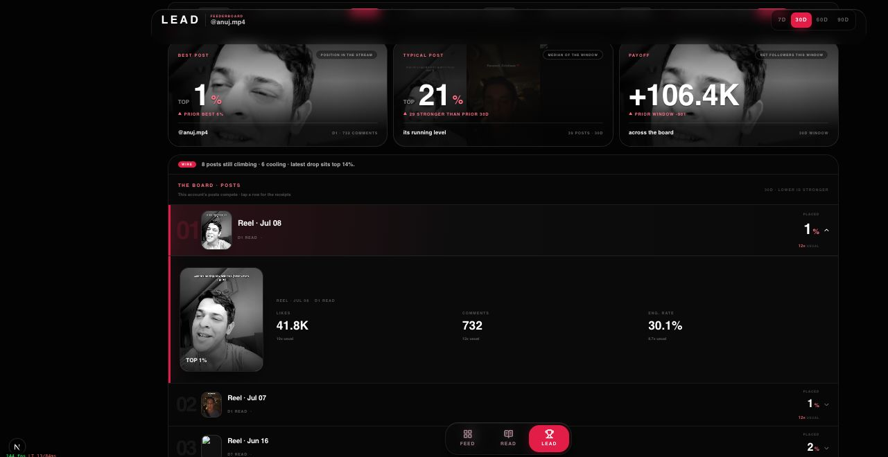
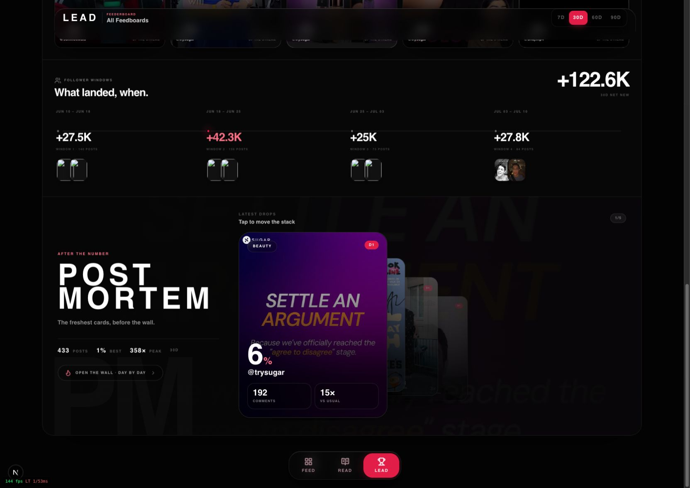
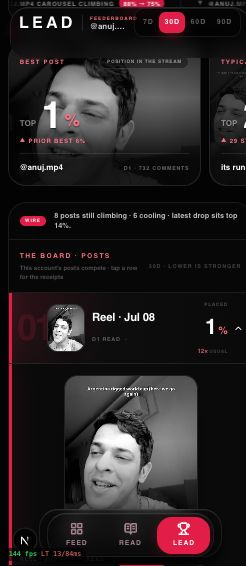
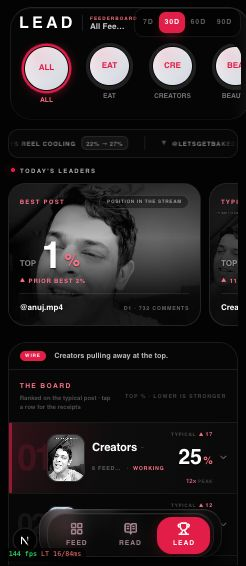

# FeedMe Lead — Apple-design audit

Audit date: 2026-07-10

Scope: `/lead`, from All Feedboards (30D) to Creators, `@anuj.mp4`, an expanded post receipt, the follower windows/Post Mortem section, and representative mobile states.

## Overall verdict

Lead has a strong visual system and the right core interaction model: comparison first, progressive disclosure second, evidence third. The three headline questions—best post, typical post, and payoff—are an excellent foundation. The Board is compact, the selected row treatment is clear, and receipts keep evidence close to the number.

The page does not yet feel simple because scope, summary, ranking, live movement, records, follower windows, and Post Mortem all use similar visual intensity. The main work is not a restyle. It is to make the comparison grammar explicit and repeat it consistently at Feedboard, feed, and feeder level.

## Captured flow

### 1. All Feedboards · 30D — solid foundation

What works:

- Best post, Typical post, and Payoff answer three different questions at a glance.
- The Board compresses a large data set into three comparable rows.
- Accent is restrained and meaningful: active scope, positive movement, and the leading row.

Gaps:

- “Today's leaders” conflicts with a 30D selection. Use “Leaders in this window” or “Current leaders.”
- The tape, leaders, Wire, Board, and Top 10 all ask for attention immediately. Keep one live-movement surface above the Board, not two.
- `▲ 17` next to `25%` requires the user to infer both the baseline and the fact that lower is better. Prefer `42% → 25%` with “17 places stronger vs prior 30D.”
- The same media repeatedly carries Best post, Payoff, Board, and Top 10, which makes the page feel louder without adding information. Reserve media for proof and keep at least one headline card purely numerical.

### 2. Creators Feederboard · 30D — strong comparison, ambiguous wayfinding

What works:

- Feed → feeder re-ranking is a natural drill-down.
- The avatar rail preserves sibling access and makes switching fast.
- The Board retains the same comparison columns, which supports familiarity.

Gaps:

- Two adjacent visible controls effectively read as “Creators”: the feed badge returns to all Feedboards, while the group icon clears feeder spotlight. Their mapping is not self-evident.
- The rail is doing breadcrumb, back navigation, scope selection, and sibling switching at once. Add an explicit `All Feedboards / Creators` breadcrumb/back affordance and let the rail be only a switcher.
- The staged feeder reveal can run for roughly a second across a long list. The content should feel ready immediately; use one critically damped reflow around 0.3–0.4s rather than a long blur-and-stagger chain.

### 3. Feeder spotlight · 30D — useful detail, mixed metric scope

What works:

- Replacing the feed Board with a post ladder is the correct change of granularity.
- The post ladder is much easier to scan than a spreadsheet and keeps FeedMe's minimal promise.
- Climbing/cooling events are deterministic state, so they fit Lead better than interpretive analysis.

Gaps:

- Best and Typical become feeder-specific, but Payoff remains feed-level (`+106.4K`, “across the board”). In the feeder context it looks feeder-attributed even though it is not. Remove it, replace it with an attributable feeder metric, or label it unambiguously as `Creators total · not feeder-attributed`.
- “The awards” includes pattern-like ideas such as Prime time. Superlatives such as most comments or largest climb fit Lead; inferred patterns and timing intelligence belong in Read.
- The page lacks a compact statement of the comparison baseline: current window versus previous equal window, with checkpoint rules.

### 4. Expanded post receipt — healthy progressive disclosure

What works:

- The selected row stays visible and the receipt appears directly underneath it.
- Media, likes, comments, engagement rate, and “vs usual” make the ranking auditable.
- `aria-expanded` is present on the row control, and the receipt links have accessible names.

Gaps:

- The only visible collapse instruction is tiny, low-contrast copy (“tap outside media to close”). Add a direct Close/Collapse control or make the row chevron stay obviously interactive.
- The receipt uses large vertical space for one proof item. On smaller screens, put the three metrics before the media so the factual answer appears before the artifact.
- The fixed bottom navigation can cover the lower part of the expanded receipt. Selection scroll positioning should account for both floating header and bottom navigation occlusion.

### 5. Follower windows + Post Mortem — strong proof, too much visual authority

What works:

- Follower windows connect payoff to time and nearby content, which is excellent evidence design.
- Post Mortem provides a lively “what just landed?” surface and is the right conceptual home for Fire's recent-card behavior.
- The stack responds on press and accepts repeated advances instead of locking the interface.

Gaps:

- Post Mortem visually becomes a second product inside Lead. Its billboard typography, background image, purple card, and deep section height overpower the comparison page.
- `Open the wall · day by day` still routes to `/fire`, contradicting the Feed/Read/Lead information architecture.
- The stack only moves forward. Add Previous and direct card position, or a swipe/drag interaction with velocity projection, so the user has agency and can reverse instantly.
- Reduce Post Mortem to a “Latest movement” section: one primary recent card, two compact next cards, and an inline day-by-day expansion. Keep the large theatrical treatment for an optional focused mode.

### 6. Mobile feeder receipt — usable but crowded

Health: needs refinement.

- The fixed header, headline carousel, selected row, expanded media, and bottom navigation compete for a short viewport.
- The content remains understandable, but the bottom navigation obscures proof and the selected scope is truncated.
- Keep the selected post's metrics above its media and use scroll margins so focused/expanded content lands in the safe visible area.

### 7. Mobile All Feedboards — readable hierarchy, accessibility risks

Health: visually coherent, interaction targets need work.

- The feed circles are comfortably sized, and the partially visible next item hints that the scope rail scrolls.
- Timeframe buttons measure about 32px high and Top/Comments/Likes/Engagement controls about 24px high; both are below a reliable 44px touch target.
- Many captions render at 7–9px with white at 24–44% opacity. Several are likely below normal-text contrast requirements and are difficult to read even without low vision.

## Apple-design assessment

### Purpose and simplicity

Lead should answer only three questions in order:

1. Who or what leads now?
2. What shifted versus the previous equal window?
3. What evidence proves it?

The current page has all three answers, but also presents live tape, Wire, leaders, Board, records, awards, follower windows, and Post Mortem as peers. Simplicity here means a stronger sequence, not fewer data points.

### Agency and familiarity

- The scope rail needs a conventional breadcrumb/back model.
- The Post Mortem stack needs a reversible path.
- Timeframe changes should show subtle loading/status feedback while keeping input available. The current data can temporarily look settled while the new window fetch completes.

### Response and motion

Strengths:

- Press feedback exists on key controls.
- Board re-ranking uses springs.
- Most large animations use `useReducedMotion` fallbacks.

Gaps:

- Feed/feeder header motion is long and staged; response should be immediate and the visual settle short.
- The compressed header clip/translate and active story-ring draw do not fully honor reduced motion.
- The endless tape pauses on hover but not on keyboard focus or touch. Provide a pause mechanism, stop on `focus-within`, and keep the reduced-motion static list.

### Materials and visual craft

- The frosted floating chrome works well and keeps hierarchy without heavy dividers.
- The accent is used with restraint in the main comparison surfaces.
- The top cards and Post Mortem reuse large media too aggressively. One image-led hero per level is enough; let typography and data carry the other surfaces.

### Typography and accessibility

Confirmed risks from the rendered DOM and implementation:

- The semantic `h1` is portaled after the main `h2` sections, so reading order encounters section headings before the page title.
- Both old Feed/Fire/Fund links and new Feed/Read/Lead links exist in the mobile focus tree even when only one navigation is visually apparent. Use one navigation source and hide/remove the old one on Lead.
- The production nav is labeled `Preview app navigation`.
- Multiple 7–9px labels use very low-opacity white.
- Several touch targets are 24–32px high.

Good foundations:

- Sections are named with headings and regions.
- Board/post rows expose expanded state.
- Proof links have accessible names.
- No console errors or warnings were present in the audited states.

## Recommended comparison grammar

| Scope | Primary question | Headline trio | Main comparison | Proof |
| --- | --- | --- | --- | --- |
| All Feedboards | Which feed leads? | Leader · biggest shift · total payoff | Feeds | Top posts + follower windows |
| One feed | Which feeder leads? | Leader · biggest shift · feed payoff | Feeders | Feeder receipts + top posts |
| One feeder | Which content leads? | Best post · typical post · biggest climb | Posts | Expanded post metrics and media |

Use the same five-part skeleton at every level:

1. Breadcrumb + global timeframe.
2. One-line factual shift summary.
3. Three headline metrics with explicit baselines.
4. One Board/ladder.
5. Evidence on demand, then compact Latest movement.

## Priority order

### P0 — fix before visual refinement

1. Unify the bottom navigation and remove old Feed/Fire/Fund links from the Lead focus tree.
2. Fix heading/reading order so `LEAD` is encountered before section headings.
3. Add explicit scope breadcrumbs and disambiguate feed badge versus all-feeders control.
4. Prevent mixed-scope metrics in feeder spotlight.

### P1 — make the page feel simple

5. Make every delta explicit as current → prior, including the comparison window.
6. Keep either Tape or Wire as the primary live-shift surface above the Board.
7. Reduce Post Mortem to a compact Latest movement section and remove the `/fire` escape hatch.
8. Raise small-label size/contrast and expand 24–32px controls to at least 44px touch targets.

### P2 — Apple-level polish

9. Shorten header scope transitions to a 0.3–0.4s critically damped reflow with no long cascade.
10. Add reversible, interruptible Post Mortem navigation and reduced-motion equivalents for remaining header/ring motion.
11. Add focus/touch pause behavior to the live tape.

## Evidence limits

This audit covered the rendered desktop and mobile states, DOM semantics, target sizes, console output, and the current motion implementation. It did not include assistive-technology testing, full keyboard traversal, measured color-contrast tooling, performance traces, real-device haptics, or user research. Those should be verified before claiming WCAG conformance or production motion quality.
